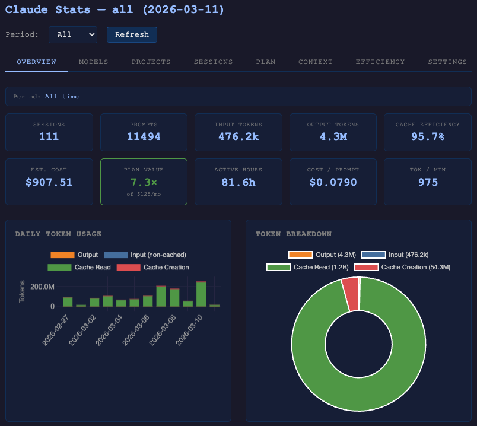

# claude-stats

Collect and visualize usage statistics from Claude Code sessions stored locally on your machine. No API key or network access required.



## Requirements

- **Node.js 22.5+** (for the built-in `node:sqlite` module)
- Claude Code installed and used at least once (`~/.claude/projects/` must exist)

## VS Code Extension

An optional extension embeds the dashboard inside VS Code with a status bar showing today's token usage. The extension is fully self-contained — all dependencies are bundled, no separate `claude-stats` install required.

Download the extension from the latest build run under "Actions" or clone and build it yourself.

```sh
git clone <repo-url> claude-stats
cd claude-stats
npm install
npm run build
npm run package:ext
code --install-extension extension/claude-stats-vscode-0.1.0.vsix
```

Open the dashboard via the activity bar icon or the Command Palette: **Claude Stats: Open Dashboard**.

## Build

```sh
git clone <repo-url> claude-stats
cd claude-stats
npm install
npm run build
```

## Commandline Usage

Link the command globally:

```sh
npm link
```

Or run directly:

```sh
node --experimental-sqlite dist/index.js <command>
```

### Quick start

```sh
claude-stats collect              # scan ~/.claude/projects/ and store session data
claude-stats report               # print a usage summary
claude-stats serve --open         # open the interactive dashboard in your browser
claude-stats report --html        # export a standalone HTML dashboard file
```

### All commands

| Command        | Description                                                  |
| -------------- | ------------------------------------------------------------ |
| `collect`      | Incrementally import session data from `~/.claude/projects/` |
| `report`       | Print usage summary, per-session detail, or trend breakdown  |
| `serve`        | Start a local web dashboard (`http://localhost:9120`)        |
| `status`       | Show database size, session count, and last collection time  |
| `export`       | Export sessions as JSON or CSV                               |
| `search`       | Search prompt history by keyword                             |
| `dashboard`    | Output pre-aggregated dashboard JSON to stdout               |
| `tag` / `tags` | Tag sessions and list tags                                   |
| `config`       | View or set cost alert thresholds                            |
| `diagnose`     | Show quarantine counts and schema health                     |

Run `claude-stats --help` or `claude-stats <command> --help` for full option details.

## Development

```sh
npm test              # run tests
npm run test:watch    # watch mode
npm run coverage      # with coverage report
npm run typecheck     # type-check without emitting
```

## How it works

Claude Code writes a JSONL file for every session under `~/.claude/projects/`. This tool reads those files incrementally, stores aggregated token counts and session metadata in a local SQLite database (`~/.claude-stats/stats.db`), and renders summaries on demand.

- **Nothing leaves your machine.** All data stays in `~/.claude-stats/`.
- **Incremental.** Only new lines are read on each `collect` run.
- **Non-destructive.** The tool never modifies Claude Code's own files.
- **No API scraping.** Unlike some alternatives, claude-stats does not call undocumented Anthropic endpoints, scrape session cookies, or inject code into Claude Code's process. It only reads the local JSONL files that Claude Code already writes to disk — fully compliant with Anthropic's Terms of Service.

See [doc/user-doc/](doc/user-doc/) for full documentation.
