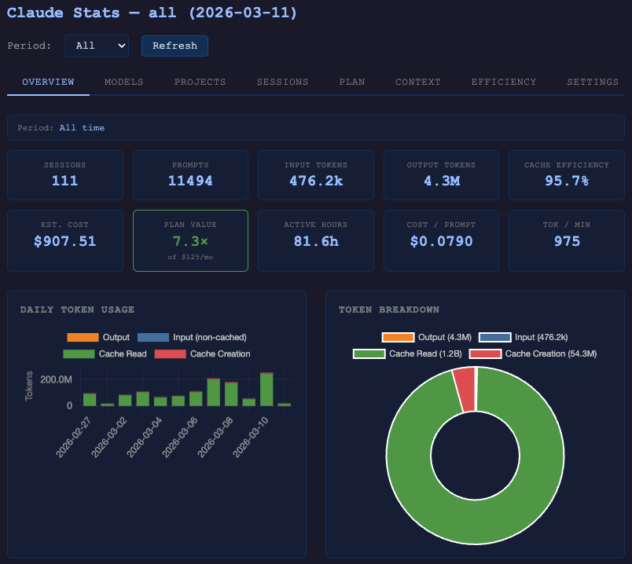

# claude-stats

Collect and visualize usage statistics from Claude Code sessions stored locally on your machine. No API key or network access required.



## Requirements

- **Node.js 22.5+** (for the built-in `node:sqlite` module)
- Claude Code installed and used at least once (`~/.claude/projects/` must exist)

## Install via AI Agent

Tell your AI agent:

> Install claude-stats from https://github.com/de-otio/claude-stats

The agent should run:

```sh
git clone https://github.com/de-otio/claude-stats
cd claude-stats
npm install
npm run build
npm run package:ext
code --install-extension extension/claude-stats-vscode-*.vsix
```

After the VS Code extension activates (reload the window if needed), it automatically:

1. Registers the MCP server in `~/.claude.json` (Claude Code's user-scope config)
2. Updates any stale registration on subsequent activations

**Restart Claude Code** after the extension installs for the MCP server to become available.

Open the dashboard via the activity bar icon or: **Command Palette (cmd+shift+p) → Claude Stats: Open Dashboard**.

## VS Code Extension Details

The extension embeds the dashboard inside VS Code with a status bar showing today's token usage. It is fully self-contained — all dependencies are bundled, no separate global install required.

**The extension also auto-registers the MCP server** in `~/.claude.json`. Once installed and Claude Code restarted, your AI agent can query your usage stats without any manual MCP configuration.

### Build and install

```sh
git clone https://github.com/de-otio/claude-stats
cd claude-stats
npm install
npm run build
npm run package:ext
code --install-extension extension/claude-stats-vscode-*.vsix
```

Open the dashboard via the activity bar icon or: **Command Palette → Claude Stats: Open Dashboard**.

## MCP Server

The VS Code extension bundles a local MCP server and registers it automatically in `~/.claude.json` (Claude Code's user-scope config) on first activation. The server runs as a child process over stdio — no network access or authentication required, all data is local.

If you need to register it manually (without the extension), run:

```sh
MCP_JS="$HOME/.vscode/extensions/de-otio.claude-stats-vscode-0.1.1/dist/mcp.js"
claude mcp add -s user claude-stats -- "$(which node)" --experimental-sqlite \
  -e "require('$MCP_JS').startMcpServer().catch(e=>{console.error(e);process.exit(1)})"
```

> **Why not just `node mcp.js`?** `mcp.js` exports `startMcpServer()` but does not invoke it when run as a plain script. The `-e` flag calls the entry point explicitly.
>
> **Why `~/.claude.json` and not `~/.claude/settings.json`?** Claude Code CLI registers MCP servers from `~/.claude.json`. The `mcpServers` key in `~/.claude/settings.json` is silently ignored for server registration.

### Available tools

| Tool                 | Description                                                                    |
| -------------------- | ------------------------------------------------------------------------------ |
| `get_stats`          | Usage summary for a period — tokens, cost, sessions, cache efficiency, streaks |
| `list_sessions`      | Recent sessions with token counts and estimated cost                           |
| `get_session_detail` | Messages and token usage for a specific session                                |
| `list_projects`      | Per-project usage breakdown                                                    |
| `get_status`         | Database health, session count, last collection time                           |
| `search_history`     | Search prompt history by keyword                                               |
| `get_cost_per_task`  | Cost per successful task — outcome-cost overall and per model (read-only)       |
| `get_account_info`   | Current login's seat tier, billing type, and known accounts on this machine     |
| `get_plan_mechanics_reference` | Dated snapshot of Team/Enterprise seat ranges, pricing, and usage-intensity benchmarks, with a staleness warning |
| `size_seats`         | Seat-sizing scenario table for a company rollout from headcount + technical fraction (never picks a plan) |

### License advisor skill

`skills/license-advisor/SKILL.md` is a repo-level Claude Code skill that walks
a stakeholder through picking a Team vs Enterprise plan and seat count using
the tools above — grounded in measured usage where it exists, falling back to
benchmarks otherwise, and surfacing the compliance and spend-limit tradeoffs
as choices rather than resolving them silently. See
[doc/user-doc/commands.md](doc/user-doc/commands.md) for the matching
`account` and `plan-advisor` CLI commands.

### Example queries

- "How many tokens have I used this week?"
- "What were my most expensive sessions today?"
- "Which projects am I spending the most on?"
- "How much CO₂ did my Claude usage cause last week?"
- "What's my cost per successful task, broken down by model?"

## Commandline Usage

```sh
npm link           # link claude-stats globally, OR
npm install -g .   # install globally from the repo root
```

### Quick start

```sh
claude-stats collect              # scan ~/.claude/projects/ and store session data
claude-stats report               # print a usage summary
claude-stats serve --open         # open the interactive dashboard in your browser
claude-stats report --html        # export a standalone HTML dashboard file
```

### All commands

| Command        | Description                                                     |
| -------------- | --------------------------------------------------------------- |
| `collect`      | Incrementally import session data from `~/.claude/projects/`    |
| `report`       | Print usage summary, per-session detail, or trend breakdown     |
| `spending`     | Detailed cost breakdown by model, session, tool, and MCP server |
| `cost-per-task`| Cost per successful task — outcome-cost overall and per model   |
| `task-outcome` | Label a task `success`/`partial`/`fail` to ground the metric    |
| `serve`        | Start a local web dashboard (`http://localhost:9120`)           |
| `status`       | Show database size, session count, and last collection time     |
| `export`       | Export sessions as JSON or CSV                                  |
| `search`       | Search prompt history by keyword                                |
| `dashboard`    | Output pre-aggregated dashboard JSON to stdout                  |
| `tag` / `tags` | Tag sessions and list tags                                      |
| `task-class`   | Classify sessions into task classes and show the distribution   |
| `config`       | View or set cost alert thresholds                               |
| `backfill`     | Re-parse all session files to populate newly added fields       |
| `diagnose`     | Show quarantine counts and schema health                        |
| `mcp`          | Start a local MCP server over stdio for AI agent access         |
| `purge`        | Delete local claude-stats data (dry run by default; `--yes` to apply) |

## Build

```sh
git clone https://github.com/de-otio/claude-stats
cd claude-stats
npm install
npm run build
```

## Development

```sh
npm test              # run tests
npm run test:watch    # watch mode
npm run coverage      # with coverage report
npm run typecheck     # type-check without emitting
```

## Maintenance

This is an informal side-project maintained for personal use — built for fun, inspiration, and experimentation. There are no promises about long-term maintenance, but it will be kept up as long as it continues to be useful personally. Feel free to fork or copy it for your own purposes.

## How it works

Claude Code writes a JSONL file for every session under `~/.claude/projects/`. This tool reads those files incrementally, stores aggregated token counts and session metadata in a local SQLite database (`~/.claude-stats/stats.db`), and renders summaries on demand.

- **Local by default.** All data stays in `~/.claude-stats/` and no network requests are made. Optional, opt-in [backup and sync](doc/user-doc/backup-and-sync.md) can copy an **end-to-end-encrypted** bundle to a cloud folder you already control — you turn it on explicitly, and your cloud provider only ever sees opaque ciphertext.
- **Incremental.** Only new lines are read on each `collect` run.
- **Non-destructive.** The tool never modifies Claude Code's own files.
- **No API scraping.** Unlike some alternatives, claude-stats does not call undocumented Anthropic endpoints, scrape session cookies, or inject code into Claude Code's process. It only reads the local JSONL files that Claude Code already writes to disk — fully compliant with Anthropic's Terms of Service.

See [doc/user-doc/](doc/user-doc/) for full documentation.
