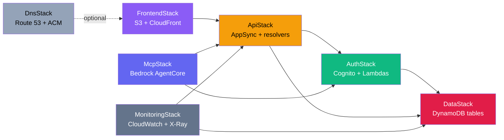

# Team App — Developer Quickstart

This guide gets you from zero to a running dev environment for the claude-stats team app.

## Prerequisites

| Tool | Version | Install |
|------|---------|---------|
| Node.js | 20+ | `brew install node` or [nvm](https://github.com/nvm-sh/nvm) |
| npm | 10+ | Ships with Node 20 |
| AWS CLI | 2.x | `brew install awscli` |
| AWS CDK | 2.175+ | `npm install -g aws-cdk` |
| Git | any | `brew install git` |

You also need an AWS account with credentials configured:

```bash
aws configure  # or use SSO / environment variables
```

## Repository Setup

```bash
git clone <repo-url>
cd claude-stats
npm install          # Installs all workspace dependencies
npm run build        # Builds core, cli, frontend, infra packages
npm run typecheck    # Verify everything compiles
npm test             # Run the test suite (486 tests)
```

## Monorepo Structure

```
packages/
  core/       Shared types, parser, pricing, i18n (consumed by all packages)
  cli/        CLI tool — local session analysis, dashboard server
  frontend/   React SPA — team dashboards, auth, challenges
  infra/      AWS CDK stacks — all cloud infrastructure
  extension/  VS Code extension
```

Key relationships:
- `core` is a dependency of every other package
- `infra` deploys Lambda handlers from `packages/infra/lambda/`
- `frontend` is built by Vite and deployed to S3 via `FrontendStack`

## Architecture Overview

The team app is a serverless AWS application built across 7 CDK stacks:

```mermaid
graph TB
    subgraph Clients
        SPA["React SPA<br/>(Vite + Tremor)"]
        CLI["claude-stats CLI"]
        MCP_CLIENT["MCP Client<br/>(Claude Desktop)"]
    end

    subgraph AWS Cloud
        subgraph FrontendStack
            CF["CloudFront"]
            S3["S3 Bucket"]
        end

        subgraph AuthStack
            COGNITO["Cognito User Pool<br/>(Custom Auth)"]
            subgraph Magic Link Lambdas
                DEFINE["DefineAuthChallenge"]
                CREATE["CreateAuthChallenge"]
                VERIFY["VerifyAuthChallenge"]
            end
            KMS["KMS HMAC Key"]
            SES["SES Email"]
        end

        subgraph ApiStack
            APPSYNC["AppSync<br/>GraphQL API"]
            JS_RESOLVERS["JS Resolvers<br/>(44 CRUD operations)"]
            LAMBDA_RESOLVERS["Lambda Resolvers"]
            AGG["aggregate-stats"]
            DASH["team-dashboard"]
            SCORE["challenge-scoring"]
        end

        subgraph DataStack
            subgraph DynamoDB
                USERS["userProfiles"]
                TEAMS["teams"]
                MEMBERS["teamMemberships"]
                SESSIONS["syncedSessions"]
                STATS["teamStats"]
                ACHIEVE["achievements"]
                CHALLENGE["challenges"]
                INTER["interTeamChallenges"]
                TOKENS["magicLinkTokens"]
                MSGS["syncedMessages"]
            end
            STREAM["DynamoDB Stream"]
        end

        subgraph McpStack
            BEDROCK["Bedrock AgentCore<br/>MCP Runtime"]
        end

        subgraph MonitoringStack
            CW["CloudWatch<br/>Dashboards & Alarms"]
            XRAY["X-Ray Tracing"]
        end

        subgraph DnsStack
            R53["Route 53"]
            ACM["ACM Certificate"]
        end
    end

    SPA -->|HTTPS| CF
    CF --> S3
    SPA -->|Auth| COGNITO
    COGNITO --> DEFINE --> CREATE --> VERIFY
    CREATE --> KMS
    CREATE --> SES
    CREATE --> TOKENS
    VERIFY --> KMS
    VERIFY --> TOKENS

    SPA -->|GraphQL| APPSYNC
    CLI -->|GraphQL + Sync| APPSYNC
    MCP_CLIENT --> BEDROCK --> APPSYNC

    APPSYNC --> JS_RESOLVERS --> DynamoDB
    APPSYNC --> LAMBDA_RESOLVERS
    LAMBDA_RESOLVERS --> DASH
    LAMBDA_RESOLVERS --> SCORE

    STREAM -->|Trigger| AGG
    AGG --> STATS

    CW -.->|Monitors| APPSYNC
    CW -.->|Monitors| DynamoDB
    XRAY -.->|Traces| LAMBDA_RESOLVERS

    R53 -.->|Optional| CF
    ACM -.->|Optional| CF

    style SPA fill:#3b82f6,color:#fff
    style CLI fill:#3b82f6,color:#fff
    style MCP_CLIENT fill:#3b82f6,color:#fff
    style APPSYNC fill:#f59e0b,color:#000
    style COGNITO fill:#10b981,color:#fff
    style CF fill:#8b5cf6,color:#fff
    style DynamoDB fill:#e11d48,color:#fff
    style BEDROCK fill:#6366f1,color:#fff
```



### CDK Stack Dependencies



## Deploying to Dev

### 1. Set your AWS account

Edit `packages/infra/lib/config/dev.ts` or set environment variables:

```bash
export CDK_DEV_ACCOUNT=123456789012   # Your AWS account ID
export CDK_DEV_REGION=us-east-1       # Target region
```

### 2. Update allowed email domains

In `packages/infra/lib/config/dev.ts`, change `allowedEmailDomains` to include your team's domain:

```typescript
allowedEmailDomains: ["yourcompany.com"],
```

### 3. Bootstrap CDK (first time only)

```bash
cd packages/infra
npx cdk bootstrap aws://123456789012/us-east-1
```

### 4. Deploy all stacks

```bash
npx cdk deploy --context env=dev --all
```

This deploys all 7 stacks. The first deploy takes ~10 minutes. Subsequent deploys are incremental.

### 5. Note the outputs

After deployment, CDK prints outputs including:
- CloudFront URL (your frontend)
- AppSync GraphQL endpoint
- Cognito User Pool ID and Client ID

These are also stored in SSM Parameter Store under `/ClaudeStats-dev/`.

## Local Frontend Development

```bash
cd packages/frontend
npm run dev            # Starts Vite dev server on http://localhost:5173
```

The frontend reads runtime config from `window.__CONFIG__`, which is injected by CloudFront. For local development, create `packages/frontend/public/config.js`:

```javascript
window.__CONFIG__ = {
  graphqlEndpoint: "https://xxx.appsync-api.us-east-1.amazonaws.com/graphql",
  userPoolId: "us-east-1_XXX",
  userPoolClientId: "xxx",
  region: "us-east-1"
};
```

Get these values from SSM after deploying:

```bash
aws ssm get-parameters-by-path --path /ClaudeStats-dev/ --recursive --query "Parameters[*].[Name,Value]" --output table
```

## Key Files Reference

| What | Where |
|------|-------|
| CDK app entry | `packages/infra/bin/app.ts` |
| Stack definitions | `packages/infra/lib/stacks/*.ts` |
| Environment config | `packages/infra/lib/config/{dev,prod}.ts` |
| Config types | `packages/core/src/types/config.ts` |
| GraphQL schema | `packages/infra/graphql/schema.graphql` |
| AppSync JS resolvers | `packages/infra/graphql/resolvers/js/` |
| Auth Lambdas | `packages/infra/lambda/auth/` |
| API Lambdas | `packages/infra/lambda/api/` |
| Frontend routes | `packages/frontend/src/App.tsx` |
| Frontend API hook | `packages/frontend/src/hooks/useApi.ts` |
| Shared types | `packages/core/src/types/` |
| i18n locales | `packages/core/src/locales/{en,de}/` |

## Authentication Flow

The app uses **passwordless magic-link authentication**:

1. User enters email on login page
2. Cognito custom auth triggers `CreateAuthChallenge` Lambda
3. Lambda generates a signed token (HMAC-SHA-256), stores hash in DynamoDB, emails link via SES
4. User clicks link → frontend calls `VerifyAuthChallenge`
5. Lambda validates HMAC, checks expiry + single-use → Cognito issues JWT

Dev settings are relaxed: 60-minute token TTL, 20 requests/hour. Rate limiting is enforced at the Lambda level (DynamoDB sliding window per email).

**SES identity is created automatically** by the `AuthStack`. In **dev** (no `domainName`), an email identity for `noreply@claude-stats.dev` is created — check that inbox and click the verification link. In SES sandbox mode, you must also verify each recipient address. In **prod** (with `domainName`), a domain identity is created with DKIM — add the CNAME records shown in the SES console to your hosted zone. To move out of sandbox mode, request production access via the SES console.

## GraphQL API

The AppSync API uses Cognito for auth. The schema defines:

- **User management** — profiles, preferences, linked accounts
- **Teams** — create, join, invite, roles (admin/member)
- **Sessions** — synced Claude usage data with share levels (full/summary/minimal)
- **Challenges** — team and inter-team coding challenges with leaderboards
- **Achievements** — gamification badges with category-based progression

Resolvers are split:
- **JS resolvers** (in `graphql/resolvers/js/`) — direct DynamoDB CRUD, low latency
- **Lambda resolvers** — complex operations (aggregation, scoring, dashboard stats)

## Running Tests

```bash
# From repo root
npm test                   # All tests
npm run coverage           # With coverage report

# Watch mode during development
npx vitest --watch

# Run a specific test file
npx vitest packages/cli/src/__tests__/pricing.test.ts
```

Coverage thresholds are set at 80% for statements, branches, functions, and lines.

## Common Tasks

### Add a new DynamoDB table

1. Add table definition in `packages/infra/lib/stacks/data-stack.ts`
2. Export table ARN/name via SSM parameter
3. Add data source in `packages/infra/lib/stacks/api-stack.ts`
4. Add types in `packages/core/src/types/`

### Add a new GraphQL operation

1. Add type/query/mutation to `packages/infra/graphql/schema.graphql`
2. Create JS resolver in `packages/infra/graphql/resolvers/js/`
3. Wire resolver in `api-stack.ts`
4. Add frontend hook in `packages/frontend/src/hooks/useApi.ts`
5. Add i18n keys in `packages/core/src/locales/{en,de}/frontend.json`

### Add a new page

1. Create component in `packages/frontend/src/pages/`
2. Add route in `packages/frontend/src/App.tsx`
3. Wrap with `<RequireAuth>` if authenticated access required

### Add a new Lambda

1. Create handler in `packages/infra/lambda/{auth,api,mcp}/`
2. Define Lambda function in the appropriate stack
3. Grant IAM permissions for DynamoDB/SES/etc.
4. Add tests in `packages/infra/lambda/__tests__/`

## Design Documents

The `doc/analysis/team-app/` directory contains 18 detailed design documents:

| # | Topic | Key decisions |
|---|-------|---------------|
| 01 | Architecture | Service inventory, data flows |
| 02 | Authentication | Magic link flow, abuse protection |
| 03 | Authorization | RBAC: superadmin, team admin, member |
| 04 | Data Model | DynamoDB schema, GSI design, TTLs |
| 05 | API Design | GraphQL schema, resolver strategy |
| 06 | Sync Strategy | Offline-first, secret scanning, data boundaries |
| 07 | Frontend | React/Tremor UI, page layouts, Amplify config |
| 08 | MCP Server | Bedrock AgentCore, tool definitions |
| 09 | Infrastructure | CDK stacks, constructs, SSM parameters |
| 10 | Team Features | Gamification, leaderboards, challenges |
| 11 | Account Separation | Work vs personal, selective sharing |
| 12 | Environments | Dev/prod config, deployment pipeline |
| 13 | Cost Protection | Budget alerts, concurrency caps, DLQs |
| 14 | Monitoring | CloudWatch dashboards, alarms, X-Ray |
| 15 | Testing | Unit, integration, E2E strategy |
| 16 | Operations | Runbooks, account deletion, backup |
| 17 | Client Setup | CLI backend discovery, token storage |

## Troubleshooting

**`Cannot find package '@claude-stats/core'`** — Run `npm run build` from the repo root. The core package must be built before other packages can import from it.

**CDK deploy fails with "Resource already exists"** — Another developer may have deployed to the same account. Use a different `envName` or coordinate on a shared dev account.

**Magic link email not received** — Verify the SES identity status in the AWS console (SES > Identities). In dev (sandbox mode), both the sender and recipient must be verified. For prod, ensure DKIM CNAME records are added to your DNS and the domain shows "Verified". Check the `CreateAuthChallenge` Lambda logs in CloudWatch and the SES dashboard for bounces/complaints.

**Frontend shows blank page** — Ensure `config.js` has correct values from SSM. Check browser console for Amplify configuration errors.
